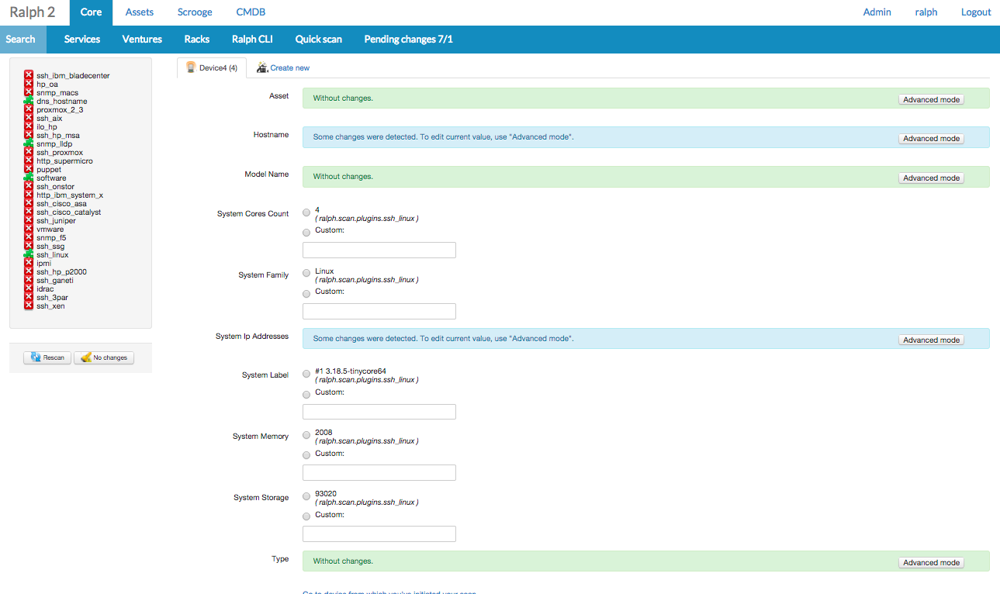

Quickstart
==========

Let's learn Ralph by example. Throughout this tutorial, we’ll walk you through:

- adding asset information, licences and support
- scanning asset details and configuration
- access billing information

Assets
^^^^^^

Fitlering the assets
---------------------------------

Let's start with the main screen. Here you find all your hardware assets which
are in the database. Use the left column for filtering of the assets.

There are two types of assets -- devices and parts. A device could be a blade
server, and a part is a component of this server, for example memory or hard
disk drive. A part can be assigned to a single device at a time. You can move
parts from one device to another when you need it.

Adding Assets
-------------

If you want add asset you need to fill a few required fields.
Look at the screen below (you can zoom-in the image in your browser if you
want) The fields in **bold** are required. Rest of fields are optional.

.. image:: _static/add-data-center-asset-form.png
    :scale: 30%

Let's describe each of the fields:

- **Basic info**:
    - **Type** - a read only field for data center
    - **Model** - choose a model for asset, (you can type a couple of letters
      to search for a given model. If no result is found, just click "Add"
      button to add it)
    - **Inventory number** - an alphanumeric value in your stock
    - **Warehouse** - the place where the asset is located
    - **Location** - a more exact location of the device in the building/room
    - **Status** - an asset's lifetime indicator. Newly bought assets has
      status "new". You can change it as required according to your own work
      flow
    - **Task url** - url to task in ticket system
    - **Additional remarks** - field for various data
    - **Service name** - service name to which this asset belongs
    - **Property of** - company to which this asset belongs
    - **Hostname** - read-only field telling the name of host (from Ralph-core
      device)
    - **Service catalog** - Default service (for which the service is a device example: cache, www)
    - **Environment** - points to environment which asset belongs to
    - **Region** - set ``region`` for this asset (see ``region`` page for
      details)
- **Financial Info**:
    - **Order number** - number of the order where this asset is included
    - **Invoice date** - date of the invoice where this asset is included
    - **Invoice number** - number of the invoice where this asset is included
    - **Price** - unit price of this asset
    - **Provider** - name of the provider of this asset
    - **Depreciation rate** - number of months in which asset depreciates
    - **Source** - asset was purchased or salvaged
    - **Request date** - date of submission of the demand for this asset
    - **Provider order date** - date when order of this asset was provided
    - **Delivery date** - date of asset delivery
    - **Depreciation end date** - the end day of the depreciation
    - **Budget info** - name of budget which funds this asset
    - **Force depreciation** - force depreciation for this asset despite of
      ``depreciation end date`` value
- **User info**:
    - **User** - points to user of this asset
    - **Owner** - points to a owner of this asset
- **Aditional info**:
    - **Data center** - points to a data center which contains this asset
    - **Server room** - points to a server room which contains this asset
    - **Rack** - points to a rack which contains this asset
    - **Position** - points to position in rack from 0 to 'max u'
    - **Orientation** - side of rack, depends on ``position``

      if ``position`` = 0 options are: *left*, *right*

      if ``position`` > 0 options are: *front*, *back*, *middle*

    - **Slot number** - points to slot number in *blade* when asset model is
      *blade*
    - **Ralph device id** - points to to Ralph-Core device
    - **SN/Sns** - serial numbers
    - **Barcode/Barcodes** - barcodes number

Quick Scan IP Address
----------------------

Ralph is able to periodically scan your all networks/environments and detect hardware information, software configuration and location.

But in this case we will use One-shot quickscan feature to scan localhost as an example.

Open Core tabs and click Quick Scan

.. image:: _static/ralph_quick_start_quick_scan.png

Insert IP Address 127.0.0.1 (press enter)

And Click 'Scan' button

After scanning asset we have a view device information

You can change the settings detected by scanner and save your changes to the asset.

Adding Parts
------------

In the same way you can add parts to the database, and then bind the parts to
devices. To do this, choose "Add part" from the menu.

.. image:: _static/asset_add_part.png
    :scale: 55%

- When a part is marked as ``salvaged``, you can enter the old barcode data here.

Asset fields has been split into sections in forms:

- **Basic info**:
    - **Type** - a read only field for data center, back office or administration for back offic. Administration is used for assets like buildings etc.
    - **Model** - type a couple of letters to search for a given model. If no result is found, just click "Add" button to add it.
    - **Inventory number** -
    - **Warehouse** - the place where the asset is located.
    - **Location** - a more exact location of the device in the building/room.
    - **Status** - an asset's lifetime indicator. Newly bought assets has status "new". You can change it as required according to your own work flow.
    - **Task url** - url to task in ticket system
    - **Additional remarks** - additional info.
    - **Service name** - service name to which the asset belongs
    - **Property of** - to which the company belongs asset
- **Financial Info**:
    - **Price** - the unit price of the asset.
    - **Provider** - the name of the provider of the asset.
    - **Depreciation rate** - number of months this device deprecates
    - **Source** - if this device was purchased or salvaged
    - **Request date** - date of submission of the demand for the device.
    - **Delivery date** - date of device delivery.
    - **Deprecation end date** - the end day of the depreciation
    - **Order number**, **Invoice date**, **Invoice no**, **Provider order date**, **Budget info**.
- **User info**:
    - **User** - device user.
    - **Owner** - device owner.
- **Aditional info**:
    - **U level** - "U" level of installation device.
    - **U height** - how large the device is, in "U".
    - **Ralph device id** - ID device detected by Ralph Scan.

Bulk Editing
------------

It is often required to edit multiple assets at once. For example, when you
want to move them from one warehouse to another. There is a special mode called
"bulk edit" for this case.

To activate this mode, go to the search screen, and select multiple assets
using check marks on the left side.

.. image:: _static//bulk-1.png

When ready, choose "Edit selected" from the bulk edit actions.

.. image:: _static//bulk-2.png
    :scale: 55%

On the next screen you can edit those records all at once by changing the
appropriate fields. When you fill one field with the desired value, you can
propagate this value to all records by clicking on the "plus" mark near the
current cell.

Work Flow and Statuses
----------------------

.. image:: _static/edit-device-status.png

In this version there are no limits for moving assets from one status to
another.  You can freely change statuses.  All changes will be recorded,
allowing you to inspect the flow later.

Licences
^^^^^^^^
Ralph Assets allows you to store information about software licences.
Adding and editing is performed in much the same way as in assets.

Adding Licence
--------------

To add a licence, click the "Add licence" option from the top of submenu.

.. image:: _static/add_licence.png
    :scale: 75%

Licence fields are split into 2 section: **Basic info** and **Financial info**.
**Financial info** contains field, **Number of purchased items**.
This field capacity to store Multi-Seat licence.

Relations
---------

Licences may be related to a user or device.
In asset and user form, during the search are shown only unassigned licence,
that is, those that have still free slots.

Supports
^^^^^^^^

Ralph Assets allows you to store information about supports.
Adding and editing is performed in much the same way as in assets.

Adding Support
--------------

To add a support, click the "Add support" option from the top of submenu.

.. image:: _static/add_support.png
    :scale: 75%

Scrooge
^^^^^^^
Scrooge module brings billing functionality to Ralph. Using Ralph Scrooge, you can retrieve information on the use of resources from many other systems and charge other services. Scrooge generates flexible and accurate cost reports and lets you refer to historical usages and costs.

Ralph Scrooge is a combination of IT management and accounting software. By using Scrooge your company can optimize the costs of internal services and departments, by reviewing their structure and dependencies.

.. image:: _static/scrooge_start.png
    :scale: 75%

Costs report
-------------
A detailed report of costs for each service

.. image:: _static/scrooge_costs_report.png
    :scale: 75%

.. image:: _static/scrooge_costs_report2.png
    :scale: 75%

Monhtly costs
-------------
Calculate monthly costs based on invoices which are added from Assets.

.. image:: _static/scrooge_monthly_costs1.png
    :scale: 75%

Select a date for the report, and then click the Recalculate costs.

.. image:: _static/scrooge_monthly_costs2.png
    :scale: 75%

After generating a report, you can close it by clicking "Accept costs"

.. image:: _static/scrooge_monthly_accept.png
    :scale: 75%

Racks
^^^^^
The Racks browser lets you see the physical organisation of your datacenter, indicating where every device is located.

Admin
^^^^^

Administration interface is accessible from within the menu.

Here you can define

* models,
* categories,
* warehouses,
* other dictionary data.
