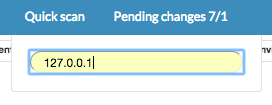

Raph Quick Start
==========================

Let's learn Ralph by example. Throughout this tutorial, we’ll walk you through:

- adding asset information, licenses and support
- scanning asset details and configuration
- access billing information

Add new asset
----------------
Open the Assets tabs with you can manage provides advanced Asset management system.

Then select "Add device"

Fill the form with the sample data

**Basic-info:**

- Model: blade-server
- Warehouse: Warehouse #1
- Service catalog: Default service
- Environment: Default Environment
- Region: Default Region
- Hostname: localhost
- IP address: 127.0.0.1

**Additional Info:**

- Data center: DC1
- Server room: Server #1
- Rack: Rack2
- Position: 1
- Slot number: 1
- Ralph device id: ae3816a0
- SN/SNs: ae3816a0-ce08-11e4-b832-0242ac110090
- Barcode/Barcodes: ae3816a0-ce08-11e4-b832-0242ac110090

Next Quick Scan IP Address
----------------

Ralph is able to periodically scan your all networks/environments and detect hardware information, software configuration and location.

But in this case we will use One-shot quickscan feature to scan localhost as an example.

Open Core tabs and click Quick Scan

Insert IP Address 127.0.0.1 (press enter)

.. image:: _static/ralph_quick_start_scan.png
    :width: 600px

And Click 'Scan' button

After scanning asset we have a view device information

.. image:: _static/ralph_quick_start_scan_result.png
    :width: 600px

You can change the settings detected by scanner and save your changes to the asset.
