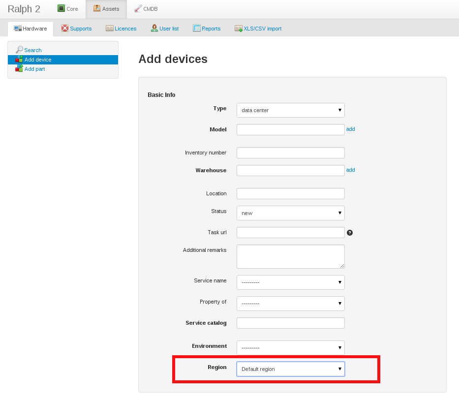
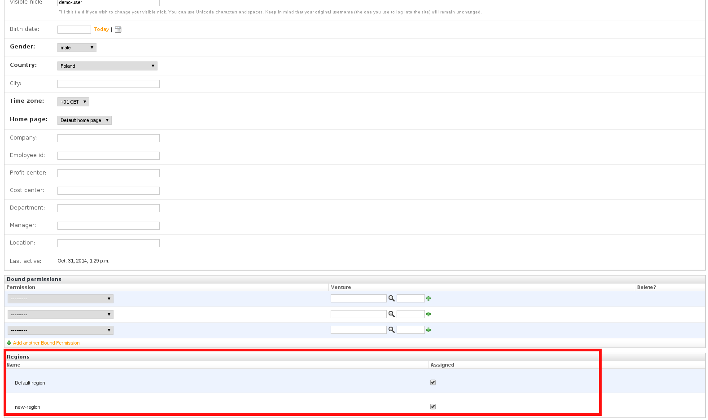
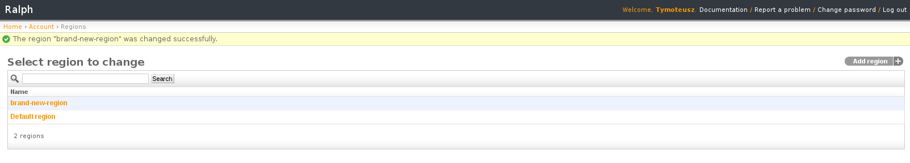

Regions
=======

Imagine such case... You've got Ralph application with many assets, your
company is expanding and new departments are rising. There is a big chance
that you would like to isolate *assets* access among the departments. You can
do it. There is a feature called *regions*. 

How to use it?
--------------
The *Regions* feature depends on two things:

- *region* is assigned to Ralph *user* (one *region* or many *regions*),
- *region* is assigned to *asset* (only one *region*).

If asset's *region* and user's *region* match, *user* see such asset.
If asset's *region* and user's *region* does not match, *user* does not see such asset.

The assigning *region* to *user* (or *asset*) is done by Ralph forms.

Assigning region to asset
.........................
*Region* can be assigned to *asset* by regular asset's form, like:

Assigning region to user
........................
*Region* can be assigned to *user* by *admin* form, like:

Adding new region
.................
If you would like to add new *region*, you can do it by *admin* form, like:

To avoid necessity of setting *region* on each *user*. There is a default
region, called: "Default region".
You can easily change it by Ralph settings, like::

    DEFAULT_REGION_NAME = 'my-custom-name-for-default-region'

The above description is about using *regions* with *assets*. This is not the
only option. *Regions* also can be used with *Supports* and *Licences* as
well. The way of using it is analogical to *assets* described above.
