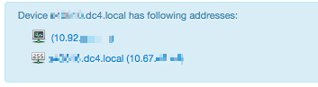
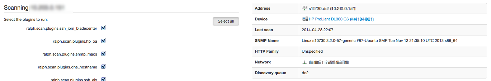
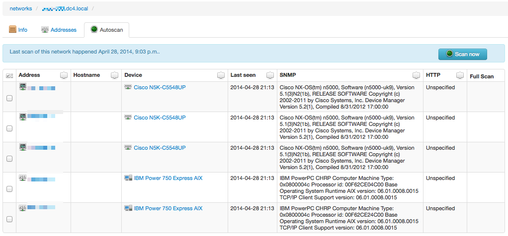

`Scan` - Device discovery
==========================

Scan is a new discovery mechanism for Ralph which is stable and fast.

Ralph is able to periodically scan your all networks/environments and detect hardware information, software configuration and location.
Currently we have 30 plugins for hundreds of common hardware, but it's very easy to write your own plugin for the specific king of hardware. It's possible to enter this information manually too.

Preparing
---------

You need to have rqworker running on the environment you want to scan.
You do that with the command::

(ralph)$ ralph rqworker [your_worker_name]

It's possible to make some workers to only process the addresses from certain
environments. The environment definitions have a ``queue`` parameter which
tells to which worker queue the discovery requests should be sent. When
starting a worker you can provide queue names as parameters to specify on
which queues the workers should listen on.

It is advised to have the scan command called from a Cron job on
the server at least once a day, so that the information in the database is up
to date.

Scanning existing device
------------------------

The best way to use scan is using GUI.

1. From any device view select 'Scan' tab.
2. Choose IP Address for scan.

3. Choose appropriate plugins you want to use, or select 'all'. There is some
information on the right side from pre-scan plugin which try to detect SNMP
version used, and http service available.

4. Click 'Scan' and view and accept results on the next screen.

.. image:: _static/scan_summary.png
    :width: 600px

Scanning new devices
--------------------

1. You have to add network, and discovery environment using admin panel.
2. Go to 'Networks' module and find network you want to scan.
3. Chose 'Autoscan' tab.
4. If network was not scanned before you should click 'Scan now'. IP Addresses
   will be shown to you.
5. Click on given IP address to view scan results, or if 'Full scan' column is
   filled in, you could immediately view scan results.

6. Now you can view and accept scan results.

.. image:: _static/scan_summary.png
    :width: 600px

Plugins configuration
---------------------

Most plugins will require some configuration before they can be successfully
used by Ralph. This is usually the login and password that they need to use
to log into whatever service they use. All that configuration should go to the
``~/.ralph/settings`` file.

.. warning::
    Make sure that the settings file is not readable to users who shouldn't see
    all those passwords!

You will need to have that configuration file on every worker that is supposed
to run discovery.

Discovery plugins
-----------------

Ralph comes with a number of discovery plugins built in. Some of them are
necessary for discovery to function, others can be safely skipped.

Ping Plugin
~~~~~~~~~~~~

This plugin requires no additional settings. It will ping the specified IP
address to check whether it is available. Most discovery plugins will not run
if this plugin failed. This plugin doesn't create any devices in the database.

HTTP Plugin
~~~~~~~~~~~

This plugin will attempt to connect to ports 80 and 443 of the specified IP
address and try to get a page using HTTP or HTTPS, respectively. Then it will
parse its response headers and body content, and attempt to guess the vendor
and model of the device in question, using a number of hard-coded heuristics.
This plugin doesn't require any configuration. This plugin doesn't create any
devices in the database.

SNMP Plugin
~~~~~~~~~~~

This plugin will try to connect to the specified IP address through the SNMP
protocol, and retrieve its System Name property. To function properly, this
plugin needs to know the list of SNMP communities to try, which you set in the
``SNMP_PLUGIN_COMMUNITIES`` variable. Optionally, this plugin can also attempt
to use SNMP version 3 -- then it also needs ``SNMP_V3_USER``,
``SNMP_V3_AUTH_KEY`` and ``SNMP_V3_PRIV_KEY`` set. This plugin doesn't create
any devices in the database, but collects information that is later used by
many other plugins.

SNMP MAC Plugin
~~~~~~~~~~~~~~~

This plugin will attempt to get the list of device's MAC hardware addresses
through the SNMP protocol. In addition, it may be able to retrieve the model
name and serial number for some models of devices. It doesn't require any
additional configuration, apart from that already done for the ``SNMP Plugin``.
If it retrieves the MAC addresses or a serial number, it will create a device
in Ralph's database.

IPMI Plugin
~~~~~~~~~~~

This plugin will try to connect to the specified IP using the IPMI protocol,
and attempt to retrieve information about the device's vendor, model, serial
number, MAC addresses and hardware components. If it succeeds, it creates a
corresponding device in the Ralph's database. For proper operation this plugin
requires a ``ipmitool`` binary to be installed, and the ``IPMI_USER`` and
``IPMI_PASSWORD`` settings variables set.

HTTP Supermicro Plugin
~~~~~~~~~~~~~~~~~~~~~~

This plugin will attempt to log into the web interface of a Supermicro server
management, and scrap the information about its hardware MAC addresses. If
successful, it will create a corresponding device in Ralph's database. It will
use the same credentials as the ``IPMI Plugin``.

SSH Linux Plugin
~~~~~~~~~~~~~~~~

This plugin will attempt to connect to the specified IP address using SSH, log
into the configured user account and retrieve information about the device's
hardware using common linux commands. This plugin requires that the remote
system allows logging in using the ``SSH_USER`` and ``SSH_PASSWORD`` or
``XEN_USER`` and ``XEN_PASSWORD`` as credentials. It also requires that this
user is allowed to run ``sudo dmidecode``, ``ip``, ``hostname``, ``uname``,
``df`` and read ``/proc/meminfo`` and ``/proc/cpuinfo``. If the plugin manages
to retrieve the MAC addresses or device's serial number, it creates a
corresponding entry in Ralph's database.

SSH Proxmox Plugin
~~~~~~~~~~~~~~~~~~

This plugin will attempt to connect to the specified IP address using SSH, log
into the root account using configured ``SSH_PASSWORD`` and retrieve
information about the virtual servers running in a Proxmox cluster on this
server. It will add the information about those virtual servers to the Ralph's
database.

Proxmox 2/3 Plugin
~~~~~~~~~~~~~~~~~~

This plugin is a slightly improved version of ``SSH Proxmox Plugin``. The main
difference here is that apart from using SSH, it uses Proxmox API for data
retrieving, which is available for Proxmox 2.x and 3.x. Therefore, it allows
for more detailed queries and convenient separation of plugins for further
development (i.e. ``SSH Proxmox Plugin`` for 1.x and ``Proxmox 2/3 Plugin`` for
2.x and 3.x). Apart from those differences, this plugin is configured exactly
the same as the previous one.

SSH XEN Plugin
~~~~~~~~~~~~~~

This plugin will attempt to connect to the specified IP address using SSH, log
into it configured ``XEN_USER`` and ``XEN_PASSWORD`` and retrieve information
about the virtual servers running in a XEN cluster on this server. It will add
the information about those virtual servers to the Ralph's database. For this
plugin to work correctly, the server needs to have the account configured to
allow login and executing of the following commands::

    sudo xe vif-list params=vm-name-label,MAC
    sudo xe vm-disk-list vdi-params=sr-uuid,uuid,virtual-size vbd-params=vm-name-label,type,device
    sudo xe sr-list params=uuid,physical-size,type
    sudo xe vm-list params=uuid,name-label,power-state,VCPUs-number,memory-actual

SSH Ganetti Plugin
~~~~~~~~~~~~~~~~~~

This plugin will attempt to connect to the specified IP address using SSH, log
into it configured ``SSH_USER`` and ``SSH_PASSWORD`` and retrieve information
about the virtual servers running in a Ganetti cluster on this server. It will
add the information about those virtual servers to the Ralph's database.

Integration with external services
----------------------------------

Ralph can communicate with some external services.

OpenStack
~~~~~~~~~

If you configure the variables ``OPENSTACK_URL``, ``OPENSTACK_USER`` and
``OPENSTACK_PASSWORD`` to point to the nova API of your OpenStack instance,
then you can use the command::

    (ralph)$ ralph openstack

to pull in the billing information for OpenStack tenants for the previous day.
New "openstack" components will be then created in the catalog, where you can
set the prices for them.  That information is then displayed in the "Venture"
tab summary.

You can add an optional ``--remote`` parameter to make the command run on any
RQ worker that listens on the ``openstack`` queue.

Zabbix
~~~~~~

If you configure ``ZABBIX_URL``, ``ZABBIX_USER`` and ``ZABBIX_PASSWORD``, with
the addition of ``ZABBIX_DEFAULT_GROUP``, then you can use the command::

    (ralph)$ ralph zabbixregister

to automatically create Zabbix hosts and host templates for all the devices
that have a Zabbix integration "template" variable set in their roles.

You can add an optional ``--remote`` parameter to make the command run on any
RQ worker that listens on the ``zabbix`` queue.

Splunk
~~~~~~

If you configure ``SPLUNK_URL``, ``SPLUNK_USER`` and ``SPLUNK_PASSWORD``, then
you can use the command::

    (ralph)$ ralph splunk

to download usage information about all the hosts from Splunk. New components
will be created in the catalog, where you can set their prices. That
information is then displayed in the "Venture" tab summary.

