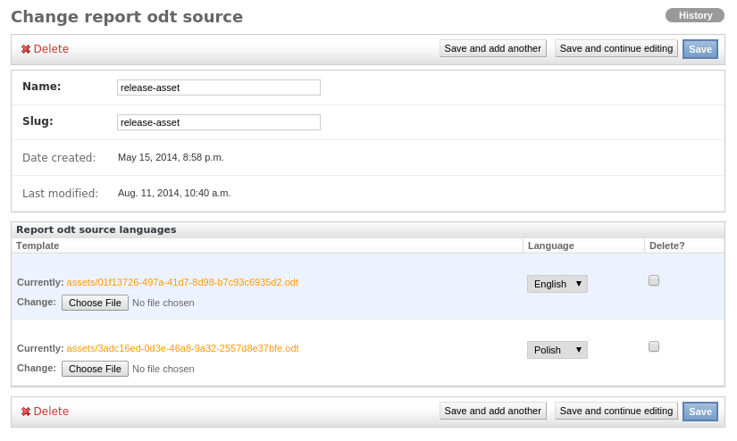

.. _transitions:

Transitions
===========

Give the opportunity to take advantage of the transition, which facilitating multi-changes in assets including generation report file.

Configuration
~~~~~~~~~~~~~

Transition is disabled by default. To enable it, set settings as follow::

    ASSETS_TRANSITIONS['ENABLE'] = True

Defining your own transition requires adding transition object to the database. Actually we support following transitions: ``RELEASE-ASSET``, ``LOAN-ASSET``, ``RETURN-ASSET``, ``CHANGE-HOSTNAME``.

Each transition has default slug defined in settings. You don't have to change anything in settings and use predefined slugs in transition definition objects.

To change slugs update settings variable eg.::

    ASSETS_TRANSITIONS['SLUGS']['RELEASE'] = "your-custom-slug"

Default slugs:

    * ``release-asset`` - for ``RELEASE-ASSET`` transition
    * ``loan-asset`` - for ``LOAN-ASSET`` transition
    * ``return-asset`` - for ``RETURN-ASSET`` transition
    * ``change-chostname`` - for ``CHANGE-HOSTNAME`` transition

Actions available in transitions:

    * ``assign_loan_end_date`` - fill loan end date in form.
    * ``assign_owner`` - assign new user into assets.
    * ``assign_user`` - assign new owner into assets.
    * ``assign_warehouse`` -  assign new warehouse into assets.
    * ``change_status`` - change status into defined in ``to_status`` Transition field.
    * ``change_hostname`` - change hostname with selected country code.
    * ``release_report`` - generate release report file.
    * ``return_report`` - generate return report file.
    * ``unassign_licences`` - remove all licences assigned into assets.
    * ``unassign_loan_end_date`` - clear loan end date field in assets.
    * ``unassign_owner`` - remove owner assigned into assets.
    * ``unassign_user`` - remove user assigned into assets.

Reports
-------

To generate reports files, report template should be uploaded into 'Report odt source' model. Created model's slug should be specified. or Created model should have specified slug.
And configure `INKPY <https://pypi.python.org/pypi/inkpy>`_  module.

Slug definition per report may be overridden in settings file eg.::

    ASSETS_REPORTS['RELEASE-ASSET']['SLUG'] = 'your-slug'

You can use predefined slugs:

    * ``release-asset`` - for release asset transition
    * ``loan-asset`` - for loan asset transition
    * ``return-asset`` - for return asset transition
    * ``change-hostname`` - for manually change hostname country

Reports locale
--------------

Reports generation uses Django's *LANGUAGE_CODE* setting, however there is an
option to changed that. You can force locale only for reports by setting
*GENERATED_DOCS_LOCALE* in django's *settings*, eg:

    GENERATED_DOCS_LOCALE = 'pl'

If so, all generated reports will have polish locale.

Multilanguage support
---------------------

.. note::

    Multilanguage support introduced with version 2.5.0 of ralph_assets.

For transition:

  * ``release-asset``
  * ``loan-asset``
  * ``return-asset``

you can attach diffrent template for configured language. Configuration is very simple, see the structure below::

    REPORT_LANGUAGES = {
        'choices': (
            ('en', 'English'),
            ('pl', 'Polish'),
        ),
        'default': 'en',
    }
Values ``choices`` and ``default`` are mandatory.

Now in *Change report odt source* (admin section) you can upload ODT templates for each predefined language.

Post transition signal
----------------------
The transition feature sends post transition signal. Arguments defined by the
signal are:

  * ``user`` - signed in user executing transition,
  * ``assets`` - assets used in transition,
  * ``transition`` - tranistion which is executed.

This is an example of the signal receiver::

    import django.dispatch
    from ralph_assets import signals

    @django.dispatch.receiver(signals.post_transition)
    def post_transition_handler(sender, user, assets, transition, **kwargs):
        pass
