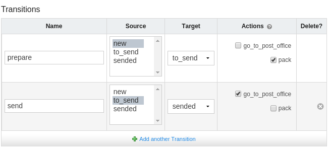

# Transitions
The transition change state (e.g. status) of object from one to another - that helps in product lifecycle management. For each object (asset, support, licence) you can define some workflow (set of transitions) and provide special actions for each transition.

## Custom template for transition
For each transition you can separately specify Django's template in the transition's form, to do this add new item to ``TRANSITION_TEMPLATES`` in your settings file. For instance:

```django
TRANSITION_TEMPLATES = [
    ('my_templates/transitions/blue.html', 'Blue version'),
    ('my_templates/transitions/red.html', 'Red version'),
]
```

## Defining action
You can easliy add new action by add method to your class and decorating with ``@transition_action``. For exmple:

```django
class Order(models.Model, metaclass=TransitionWorkflowBase):
    status = TransitionField(
        default=OrderStatus.new.id,
        choices=OrderStatus(),
    )

    @classmethod
    @transition_action
    def pack(cls, instances, request, **kwargs):
        notify_buyer('We pack your order for you.')

    @classmethod
    @transition_action
    def go_to_post_office(cls, instances, request, **kwargs):
        notify_buyer('We send your order to you.')
```

Now actions are available in admin panel when you can specify your workflow.



### Extra parameters

If your action required extra parameters to execute you can add fields:
```django
from django import forms

ALLOW_COMMENT = True

    ...
    @classmethod
    @transition_action(
        form_fields = {
            'comment': {
                'field': forms.CharField(),
                'condition': lambda obj: (obj.status > 2) and ALLOW_COMMENT
            }
        }
    )
    def pack(cls, instances, request, **kwargs):
        notify_buyer(
            'We pack your order for you.',
            pickers_comment=kwargs['comment'],
        )
```


Allowed params for field::
    ``field`` - standard form field, e.g. from ``django.forms``,
    ``condition`` - function wich accept one parameter and return boolean, when condition have be met the field will be shown.

Set ``only_one_action`` to ``True`` if the transition is to be only one action requirements.

Set ``return_attachment`` to ``True`` if action return attachment (e.g.: PDF document).

### Storing additional data in transition history

If you want to add additional information to the transition history, you need to add to the dictionary history_kwargs in your action:

```django
    def unassign_user(cls, instances, request, **kwargs):
        for instance in instances:
            kwargs['history_kwargs'][instance.pk][
                'affected_user'
            ] = str(instance.user)
            instance.user = None
```

### Share data between actions

You could also share additional data between consecutive actions using `shared_params` in the same way as `history_kwargs`.

### Rescheduling actions

Asynchronous transition (action) is capable to reschedule it later (ex. when waiting for certain condition to be satisfied, instead of active waiting). To do this, just raise `ralph.lib.transitions.exceptions.RescheduleAsyncTransitionActionLater` exception in your action.

> Both `history_kwargs` and `shared_params` are properly handled (and restored) when action is rescheduled later.
