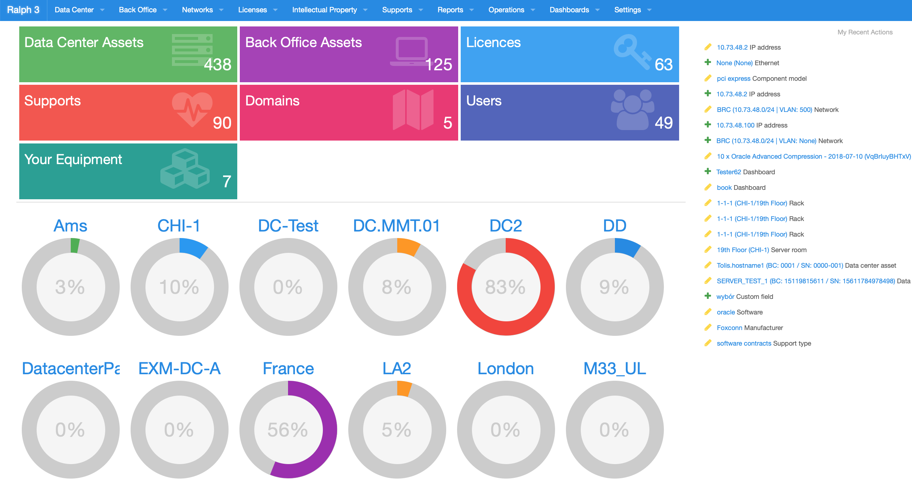

# Ralph 3 - Asset Management / CMDB

Ralph is a simple yet powerful Asset Management, DCIM and CMDB system for data center and back office.

Features:

* keep track of assets purchases and their life cycle
* flexible flow system for assets life cycle
* data center and back office support
* dc visualization built-in
