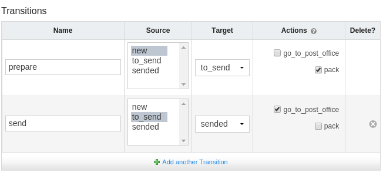
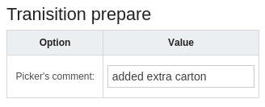

# Transitions
The transition change state (e.g. status) of object from one to another - that's helps in product lifecycle management. For each object (asset, support, licence) you can define some workflow (set of transitions) and provide special actions for each transition.

## Adding new action
You can easliy add new action by add method to your class and decorating with ``@transition_action``. For exmple:

```django
class Order(models.Model, metaclass=TransitionWorkflowBase):
    status = TransitionField(
        default=OrderStatus.new.id,
        choices=OrderStatus(),
    )

    @transition_action
    def pack(self, **kwargs):
        notify_buyer('We pack your order for you.')

    @transition_action
    def go_to_post_office(self, **kwargs):
        notify_buyer('We send your order to you.')
```

Now actions are available in admin panel when you can specify your workflow.



If your action required extra parameters to execute you can add fields:
```django
from django import forms

    ...
    @transition_action
    def pack(self, **kwargs):
        notify_buyer(
            'We pack your order for you.',
            pickers_comment=kwargs['comment'],
        )
    pack.form_fields = {
        'comment': {'field': forms.CharField()}
    }
```


