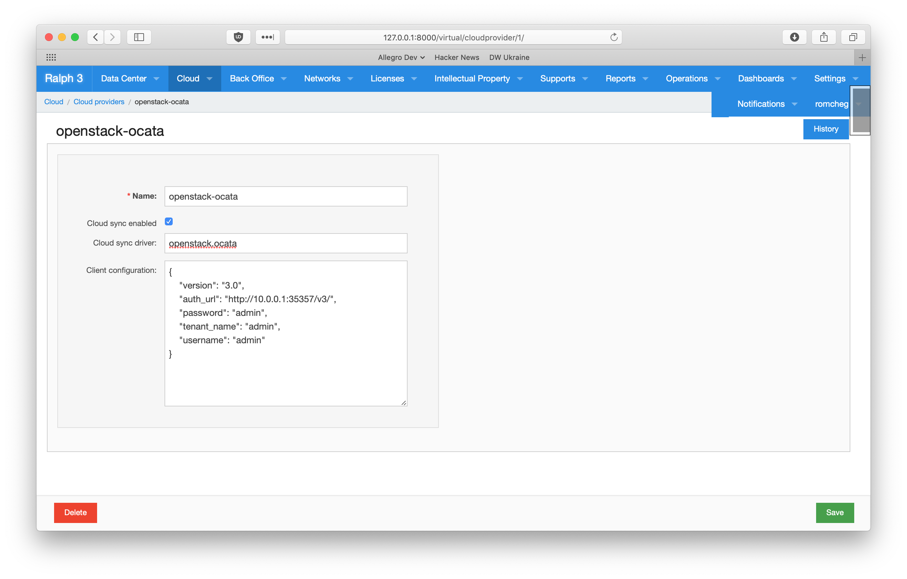

# Cloud synchronization

Ralph allows to keep cloud assets in sync with cloud providers like OpenStack,
AWS and others. The general idea is to provide an HTTP endpoint in Ralph that
consumes messages from different cloud platforms and applies appropriate
changes to cloud hosts, flavors and other objects. Although for some of the
providers this approach requires to set up an adapter connecting the provider's
event stream with the endpoint in Ralph, it is the most generic way to achieve
a close-to-real-time synchronization of cloud assets.

## Configuring cloud providers

In order to enable cloud synchronization it is necessary to determine which of
the cloud providers contain isolated sets of assets and provide isolated event
streams. Once that is done, one Cloud Provider object should be created and
configured properly in Ralph. To do that click Cloud providers from the Cloud
menu in Ralph.



The configuration options available are:

* **Name:** Name of the cloud provider.
* **Cloud sync enabled:** Specifies whether or not Ralph should generate an
  endpoint for receiving cloud messages.
* **Cloud sync driver:** Depending on the cloud provider this should contain a
  name of one of the cloud synchronization drivers provided by Ralph. Available
  drivers are listed bellow. Specifying the driver is required, if the
  synchronization is enabled.
* **Client configuration:** A JSON object containing configuration for the
  client library used by the selected synchronization driver.


## Available drivers

Currently Ralph provides the following drivers:

* **noop:** Receives every event message and then does nothing.
* **openstack.ocata:** Supports synchronization with OpenStack Ocata.

## Client configurations

Depending on the selected synchronization driver it is necessary to provide
one or another set of JSON-formatted key-value elements so the driver can
establish a connection with the external cloud provider using a client library.

Bellow there are a few examples of client configuration for available drivers:

### openstack.\* family

```javascript
{
    "version": "3.0",
    "auth_url": "http://10.0.0.1:35357/v3/",
    "password": "admin",
    "tenant_name": "admin",
    "username": "admin"
}
```

