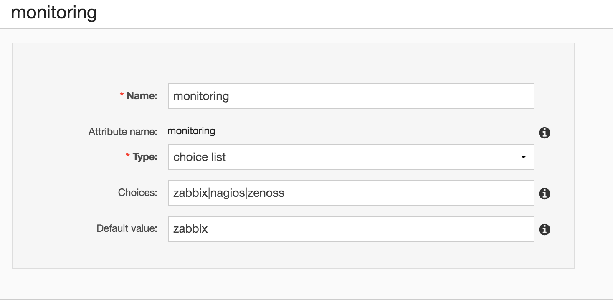
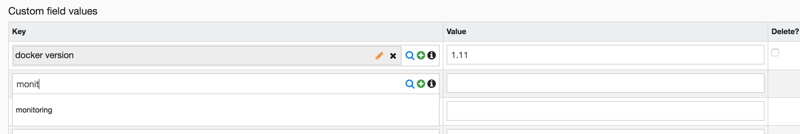
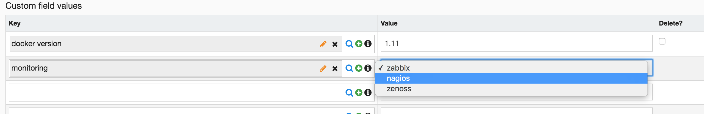

# Custom fields

Ralph's custom fields features:

* it could be attached to any model
* field could have limitation on value type (ex. have to be int, string, url, bool)
* field could have limitation on possible choices (like html's select field)

## Defining your own custom fields

To define your own custom fields, go to `http://<YOUR-RALPH-URL>/custom_fields/customfield/` or select it in menu under `Settings > Custom fields`.

Possible options:

* `name` - name of your custom field
* `attribute name` - this is slugged name of the custom field. It's used as a key in API.
* `type` - custom field type. Possible choices here are:
    * `string`
    * `integer`
    * `date`
    * `url`
    * `choice list`
* `choices` - fill it if you've chosen `choices` type. This is list of possible choices for your custom field. Separate choices by `|`, ex. `abc|def|ghi`.
* `default value` - if you fill it, this value will be used as a default for your custom field,
* `use as configuration variable` - when set, this variable will be exposed in API in "configuration_variables" field. You could use this later in configuration management tool like Puppet or Ansible.

Example:




## Attaching custom fields to objects

You could attach custom fields to any object type (if it was enabled by developers to do it for particular type).

Ralph's custom fields works pretty much the same as any other fields here. First type (part of) the name of the custom field into the `Key` field.




Then select custom field of your choice in the autocomplete list. Notice that (for some types) value field might change it's type, for example to select list. Type or select desirable value and save the changes!



> For any object, there could be at most one value for each custom field attached to it (in other words, you cannot have the same custom field attached to single object multiple times).

## API

You could change custom fields through Ralph API as simple as using it's GUI!

## Reading custom fields

Custom fields are attached in read-only form to any API (applicable) resource as a key-value dictionary.

> The key in this dictionary is `attribute_name` defined on custom field. As pointed above, it's slugged name of the custom field.

Example:
```
{
    ...
    "custom_fields": {
        "monitoring": "zabbix",
        "docker_version": "1.11"  # this field doesn't have `use_as_configuration_variable` checked, so it won't be visible in `configuration_variables` field
    },
    "configuration_variables": {
        "monitoring": "zabbix"
    },
    ...
}
```

## Filtering

You could easily filter objects by value of custom field of your choice. Preprend `attribute_name` by `customfield__` in URL of list of objects to select only matching to custom field of your choice, for example: `http://<YOUR-RALPH-URL>/api/data-center-assets/?customfield__docker_version=1.10`.


## Changing custom fields

To preview custom fields in REST-friendly way, go to `http://<YOUR-RALPH-URL>/api/<YOUR-RESOURCE-URL>/customfields/`, for example `http://<YOUR-RALPH-URL>/api/assetmodels/1234/customfields/`. Here you have custom fields attached to this particular object (in this case to model with id `1234`).

Example:
```
{
    "count": 2,
    "next": null,
    "previous": null,
    "results": [
        {
            "id": 1,
            "custom_field": {
                "name": "docker version",
                "attribute_name": "docker_version",
                "type": "string",
                "default_value": "1.10"
            },
            "value": "1.11",
            "url": "http://<YOUR-RALPH-URL>/api/assetmodels/1234/customfields/1/"
        },
        {
            "id": 29,
            "custom_field": {
                "name": "monitoring",
                "attribute_name": "monitoring",
                "type": "choice list",
                "default_value": "zabbix"
            },
            "value": "zabbix",
            "url": "http://<YOUR-RALPH-URL>/api/assetmodels/1234/customfields/29/"
        }
    ]
}
```


You could attach here new custom field value for this object (make POST request on custom fields list) or update any existing custom field value (make PUT or PATCH request on selected custom field value, ex. `http://<YOUR-RALPH-URL>/api/assetmodels/1234/customfields/29/`). For example you could make POST to `http://<YOUR-RALPH-URL>/api/assetmodels/1234/customfields/` request with following data to attach new custom field to Asset Model with ID `1234`:
```
{
    "value": "http://ralph.allegrogroup.com/manual.pdf",
    "custom_field": "manual_url"
}
```

> You could use custom field ID or attribute name to point it in API.

> Notice that every action here will happen in context of particular object - every custom field will be attached to resource pointed by current url (ex. `/assetmodels/1234`).
