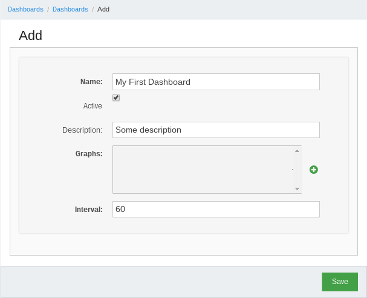
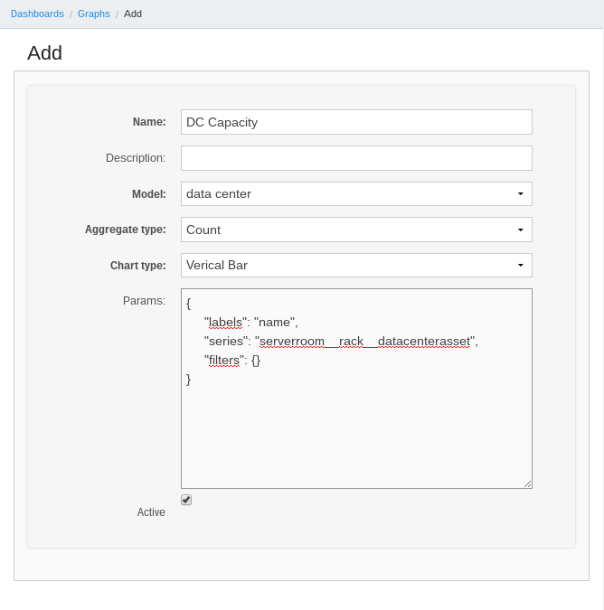
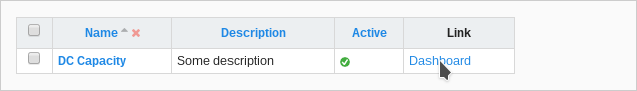
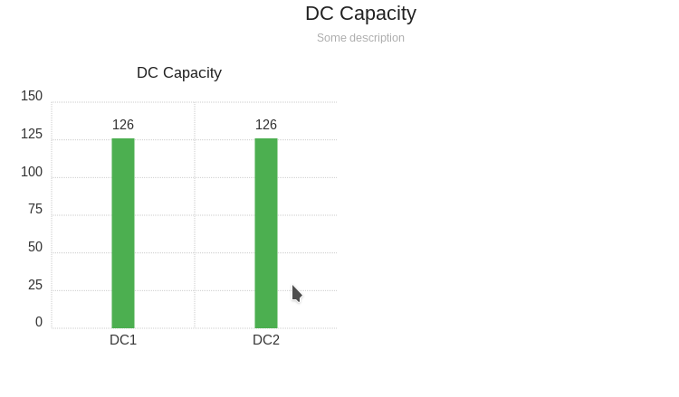

# Dashboards

The dashboard provide basic mechanism for displaying data via bar or pie charts.

# Integration with statsd
Each graph can push data to statsd. You must add ``STATSD_GRAPHS_PREFIX`` to yours settings and set ``ALLOW_PUSH_GRAPHS_DATA_TO_STATSD`` and ``COLLECT_METRICS`` to ``True``. Next, check ``Push to statsd`` on concrete graph and use Ralph's management command ``push_graphs_to_statsd`` to push your data to statsd.


## Getting started
All example data in this tutorial was generated by Ralph's command - ``ralph make_demo_data``.

### Goal
Display graphs with quantity assets in each data centers.

### First dashboard
First of all we must create new dasboard object in Ralph by clicking in menu``Dashboards > Dashboards`` next click ``Add new dashboard`` to add new one.




Next steps is create graph and configure it.


The important field of form above is ``Params`` - this field accepted configuration of graph in JSON format. Keys ``labels``, ``series``, ``filters`` are required.
Below short description of these fields:

  - ``labels`` - which field in model are string representation,
  - ``series`` - aggregate by this field,
  - ``filters`` - filter query by conditions, Django ORM-like lookup (visit [Django documentation](https://docs.djangoproject.com/en/1.8/ref/models/querysets/#id4) for more information),
  - ``excludes`` - excludes items from results - opposite to ``filters``,
  - ``aggregate_expression`` - by default is ``series``, you can override this value by correct aggregate expression (e.g. ``*`` or path to field),
  - ``target`` - contains keys: ``model``, ``filter``, ``value``; this options changes default view for clickable graph.

OK, after save go our new dashboard object. Now we can see item (``DC Capacity``) in ``Graphs`` fields - select them. After save go to ``Dashboards > Dashboards`` in list view click ``Link``.


Final result:


## Aggregating options

### distinct
``series`` allows for aggregating by distinct value. To use it, extend ``series`` query using ``|distinct`` modifier:
```json
{
    "labels": "name",
    "series": "serverroom__rack|distinct",
    "filters": {
        "series__lt": 5
    },
}
```

### Ratio
``series`` allows for calculating ratio of two aggregated fields. Set ``Aggregate type`` of graph to ``Ratio`` and use list
of two values for ``series``:
```json
{
    "labels": "service_env__service__name",
    "series": [
        "securityscan__is_patched",
        "id"
    ]
}
```

### Grouping by date
``series`` allows for aggregating based on part of the date, like ``year`` or
``month``:
```json
{
    "labels": "service_env__service__name",
    "series": "created|year",
}
```

## Special filters and fields
Special filters are some helpers to

### series
``series`` is special field which contains all annotated values and can be filtering like other fileds:
```json
{
    "labels": "name",
    "series": "serverroom__rack",
    "filters": {
        "series__lt": 5
    },
}
```

### or, and
``or``, ``and`` extend query about extra condition, e.g.:
```json
{
    "labels": "name",
    "series": "serverroom__rack",
    "excludes": {
        "name__exact|or": [null, ''],
    },
}
```
Filters accept as a argument list of elements.

### from_now
``from_now`` works only with date and date-time fields in ``filters`` section, e.g.:
```json
{
    "labels": "name",
    "series": "serverroom__rack__datacenterasset",
    "filters": {
        "created__gt|from_now": "-1y",
    },
}
```
The filter above limit query to objects which created from one year ago to now. Possible variants of period:

  - ``y`` - years,
  - ``m`` - months,
  - ``d`` - days,

<!-- (TODO(mkurek): describe limit, sort) -->
<!-- (TODO(aadamski): describe aggregate functions) -->

## REST API
You can also fetch data via REST API. Examples:

```
# get all graphs
curl https://<YOUR-RALPH-URL>/api/graph/ | python -m json.tool

# get details of graph
curl https://<YOUR-RALPH-URL>/api/graph/1/ | python -m json.tool
```

All endpoints are read only.
