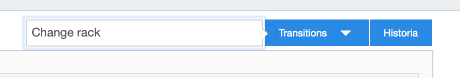
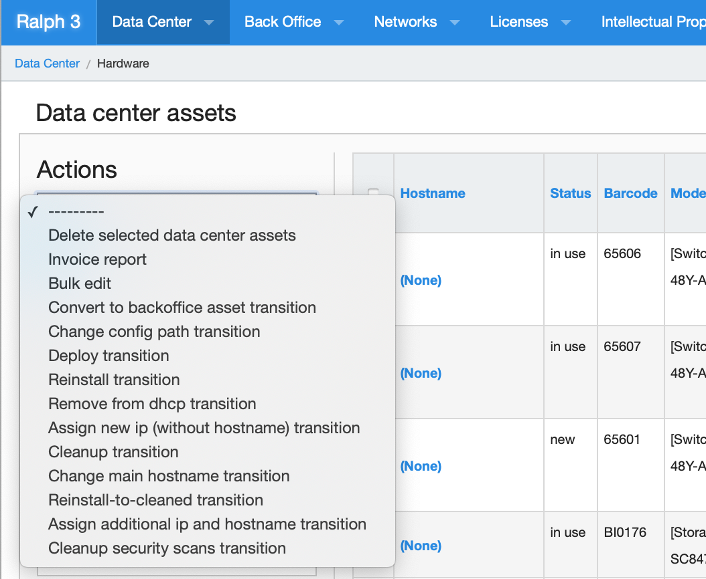
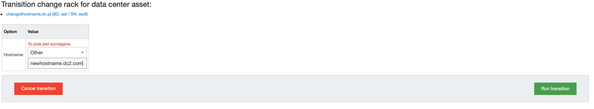
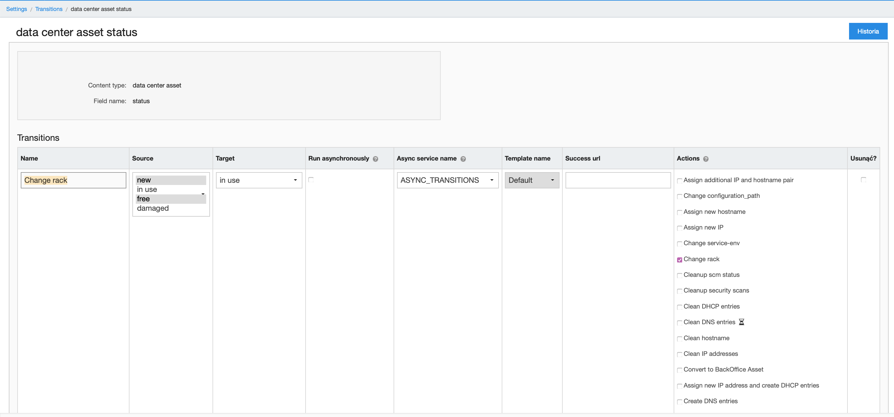

# Advanced guide

This guide handles more advanced topics, such as customization and workflows system.

## Workflow system "Transitions"

Workflow system allows triggering external or internal actions on assets. Such action can be: 

* deploy host
* scan host
* generate invoice / stock taking confirmation

You can write your own script, call external HTTP endpoint or use built-in action. 

When we think about workflow, we think about "transition" - changing asset state from one state to another. In Ralph, it means changing asset status. Action will be only available for assets which are in defined status. You can freely configure it to suite your needs.

### Example

For example, we provide built-in transition called "change-rack" which will be only available to assets with status "new". You can configure it under: Settings -> Transitions.

#### How to run transition

* Single Asset - Go to Asset View page, and run menu on top of the page:

* Multiple Assets - Go to Assets List page (e.g. Data Center -> Hardware), select multiple assets, and choose action.

#### Transition form

Some actions require additional information from the user. For example: deployment configuration, ip address, confirmation etc. 

Option / value will be presented to the user as required fields.

After running action, the status will change to "in use".

### Configuring transitions

As you can see, "transitons" are tightly integrated with statuses. You can easily  customize it to your needs.

Keep in mind, that transition are bound to the specific, defined model, such as data center asset.

First, go to "Settings -> Transitions" to view all assets types with transitions. Choose one, and see the Transitions definitions.

## PDF outprints

[ to be documented]

## Permissions

[ to be documented]

## User assets view

[ to be documented]
