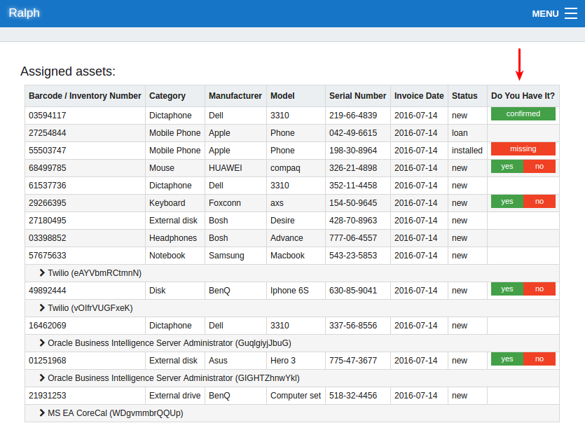

# Ralph quickstart

Ralph helps you store information about:

Data center assets:

* warehouses
* data center rooms
* servers
* racks, including graphical layout
* patch panels

Back office assets:

* printers, laptops, desktops
* mobile phones
* accesories

Non-physical assets:

* software and hardware licenses
* vendor contracts and supports
* domains including costs and contracts

## Intro

In this tutorial we will go through:

- adding new blade server to the Ralph system
- taking a dc visualization tour
- adding bought license for Microsoft Office 2015 and assign hardware to it.

## Adding the data center asset

Let's add a new Blade System which will act as a "Load balancer" system.
We want to have it visualized on the dc view, and assign some supports and licenses to it. To do this go to the `Data Center -> Hardware -> Add data center asset` menu.

There are only 3 fields required to add a new server:

* `model`
* `barcode`(or `serial number` - if the device doesn't have barcode on it)
* `service environment`

but we need to set-up them first.

### Adding the model

`Model` field helps you organize many same-model devices. You can enter 'Model' field and start typing to search model from existing database models. But don't worry, if the list is empty. Adding model is easy without leaving the form. Just click on the `+` button inside the model field.
In the new window, just name this model, for example: "PowerEdge R620". Choose category from the "three-like" menu. Don't forget to set model type to "data center" - to use it in the data center module. You can add back office models as well - just switching `type` field.

### Adding the service

`Service` field groups many devices of the same purpose, together. An example could be - "Internal Load balancing systems", "Client Joe's hardware" and so on.
This field is required for adding a new asset to the system.

`Service Environment` is a next level of details about the Service - we call it 'environments'. Examples: production, testing, development or simple "prod, test, dev". This is very important information to decide how to patch the systems, deploy it, handle upgrades, so we use this information all around the Ralph system.

Let's add "Load balancing - production" Service. To do this,
click on the small loop button next to `Service` field and click on the Button "Add Service Env" in the next window.

* Remarks is a generic placeholder for you comments about this service
* Service  - list of Services added to the system
* Environment - list of Envrionments for given Service
* Tags(optional) - you can assign "labels" if you want to better organize the data. See chapter "Tags" for more information.

As you can see, there is none of them. We have to add some information.
First - click `+` button, to add Service.

Type data as follows:

* Name: "Load balancing"
* Active: check it when the service should be visible across the system

----
Optional fields:

* UID: you can assign external id, or label, for service(e.g company's project)
* Profit Center - if all services all served by one organization(corporation), you can add profit center from accounting systems, for this project
* Business and Technical Owners - this is list of persons which are responsible for given service, in a business(features, development) and technical(sla, uptime) meaning. For example for our Load Balancing - Business Owner pays for it, sponsors it, and Technical Owner is responsible for service stability, very often, technical team leader.
* Support team - administrators team which is responsible for keeping service up and running
----

After adding new Service, add some environments below: `prod, test, dev`

And that's it. This is one-time setup, so you can use user service-env all around the system.

### Specifying the location

To view asset on the DC view, we need to specify location, and add some objects like `Racks` and `Server Rooms`. Then, you can use it freely across entire application.

* rack - click `+` to add one. Name it: "Rack1", then in the next window add Server Room with the name "Room1" - it's not required but handy to have.
* orientation and `column number` and `row number`  is used on the dc visualization, so leave it as is, we will back to it later.
* rack accesories - you can specify location for example brushes, patch panels, on given Rack, for now, just leave it as is.

Now, let's bring your attention to the `Position` field on the `Asset view`. It's U-level position inside the rack.

* `position` is the U-level-position inside the rack. If you want to install power suply for example, which is installed on the back side od Rack, please choose 0  for position. Then you can select "Orientation" for more details.
* `slot` - some type of devices in the DC can occupy single position (U). An example could be blade systems, which could store blade servers inside(on the same U position). In this case we use 'slots' field to view them on the DC Visualization properly. You can set number of slots in previosly used 'Model' adding form, using 'layout of front/back size' fields.

In our case, leave `slot` unset, and - since we want to put our Blade System to the 6-position - type 6 in the `position` field.

### Wrapping it up
The last thing required, is to fill barcode (for example: 123456) and save it.

That's it. Congratulations!

You've:
* added new service, to use it everywhere
* set-up new data center and added Rack
* installed new asset

That was easy! Now go to DataCenter -> Hardware to assets listing. And after that, go to DC Vizualization to see the Rack on the map.

## Data Center visualization

### Finding your rack
In this tutorial you will learn how to manage graphical representation of your data center.

Let's go to the "Data Center visualization" menu item, and find your data center. You should see a new rack visible on the map.

Click on 'Edit' function and try to

* drag rack to the new location
* rotate it by clicking 'rotate' button
* rename it by clicking on the pencil button

Tips:

> You can extend the data center layout by changing "Data center" grid columns and rows count.

### Adding new racks directly from dc view

You can quickly add multiple new racks from dc visualization.

To do it, enter "Edit mode" and click on the view using "plus cursor" to add multiple racks.
You can edit each of them in separation, but remember to click "Save" button when you're done.

### Accesing the DC inspector

Let's search for "Rack1" added at the beginning of tutorial. Click on dc rack view to get into the Rack detail view.

<iframe width="560" height="315" src="https://www.youtube.com/embed/Dwhg-v7W5ZU" frameborder="0" allowfullscreen></iframe>

Both back and front side of rack are displayed.

### Accessing the edit asset form

If you've played a bit with your beautiful rack, let's go back to the Asset View by clicking on the "Edit asset" in the Rack Inspector.

Here we can explain the rest of non-obvious fields of the Asset.

* `inventory number` -  could be your own, internal id, in many cases, such as: when you import some data from legacy systems.
* `task url` - could be used in your existing workflow system such as jira, if you use it.
* `force deprecation` - in some exceptions, you want to force given asset to be deprecated, even if it is still during the deprecation period.
* `required support` - check if you know that this asset will require vendor support in the future.
* `parent` - parent object in hierarchy, usally not required. Couple of examples:
    *  parent of blade server is blade system
    *  parent of virtual machine is hypervisor
    *  parent of openstack vm is openstack tenant

**Tips and tricks**
>You can reduce the numer of fields visible in the settings->permissions, if you don't use some of them.
[For information about permissions, see our advanced guide](/user/guide)

## Assigning licenses

There are 2 ways to use licenses module.

* Go to Licenses module (Licenses -> Licenses) to add new licenses, which you bought.
* Go to the particular Asset view -> Licenses. Here you can access licenses assigned to the given asset.

Let's take the first route. Let's assume, we've bought 10-users license for microsoft office 2015.

### Creating new license

Click on the Add license to add one. You have to choose:

* license type (per user, per core etc)
* software (e.g "Microsoft Office 2015") - click + to add new. In the next window, when you want to use this license everywhere (dc + back office) so choose "All"
* inventory number is your internal-company number
* region (for example: pl, en, de) allows to use separate data in separate locations. Think about it as a single software used in separate countries, locations. When you use Ralph in a single location, just create something like 'default' as a workaround.
* S/N is the field where you store your software license key/serial number.
* Number of purchased items - it's important to set number of licenses. You should not add another record for every single license bought in bulk, when you have single license key. You just have to set number of items here.

** As you can see, number of free licenses is automatically presented across entire application. **

### Assigning the licence

You can assign using "Assignments" tab in case of hardware license, or "Assigned to users" in the per user license case.

If you marked your software as - both back office and data center enabled - you will be able to find your asset added on the start of this quickstart tutorial - just type `123456` as a barcode, or search using 'Loop' icon.

If you type "10" licenses, you will use up all available licenses ("0 free").

### Licenses reports

You can analyze in the details usage of licenses, by using one of our reports.

## Vendor supports

Supports module are similar to the Licenses(it consists of Asset's tab called "Supports", and separate module in the main menu("Supports")), but the module stores different type of data.
Support is a kind of service for product you bought from Vendor, to act as a  SLA, maintenance or upgrades service.

Notable differences from the Licenses module:

* support can be only added to the Asset, not user(it's obvious, right? ;-))
* supports have additional 'Status' field to distinguish expired supports from active.

As always, you can add as many attachments(for example pdf scans of support contracts), as you want.

## Stock-taking

In the realm of business one is required to perform verification of quantities and conditions of assets owned by company. Ralph simplifies this tedious process by providing staff with tool allowing employees to report the state of assigned items effortlessly and in virtually no time.

To start stock-taking process:

* Check box in warehouse admin panel (enables stock-taking for all assets associated with given warehouse)
* Check box in region admin panel (enables stock-taking for all assets belonging to users assigned to given region)

Now users will have option to check assigned items information in `My equipment` view:

Once user confirms that they have specific asset inventory tags are added to asset record in database and are recorded in hardware history. Tags are configurable using settings file and warehouse admin. Self-stock-taking process does not conflict with regular stock-taking. When you are done you can simply un-check the boxes in admin panels.

---

So, this is it! Congratulations, you've finished our Quickstart!

You might want to learn Workflow(Transitions) tutorial and customization, PDF templates, permissions customization and many more - just follow [advanced user guide](/user/guide)
